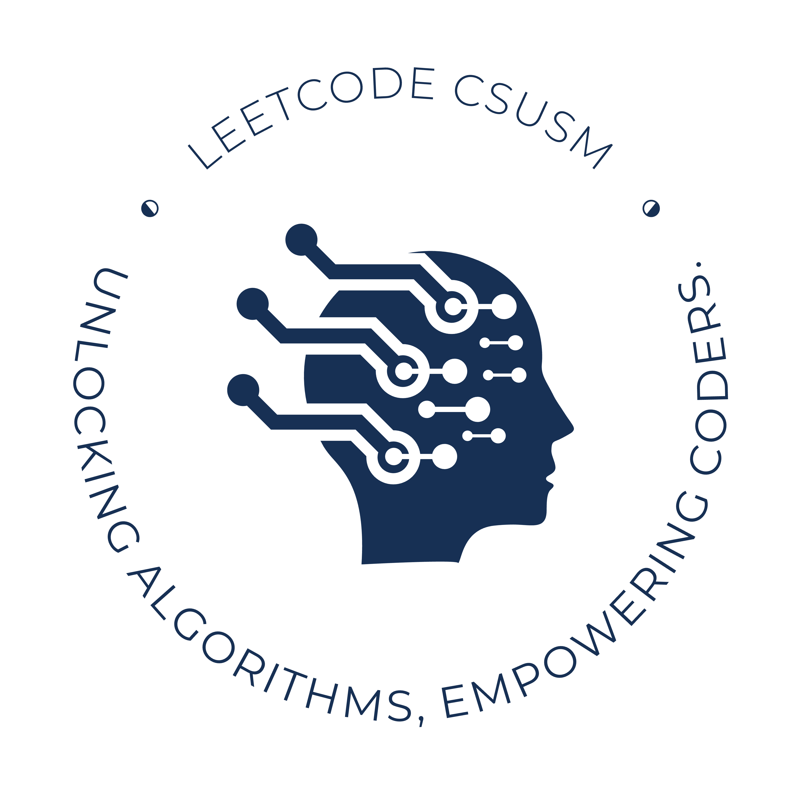
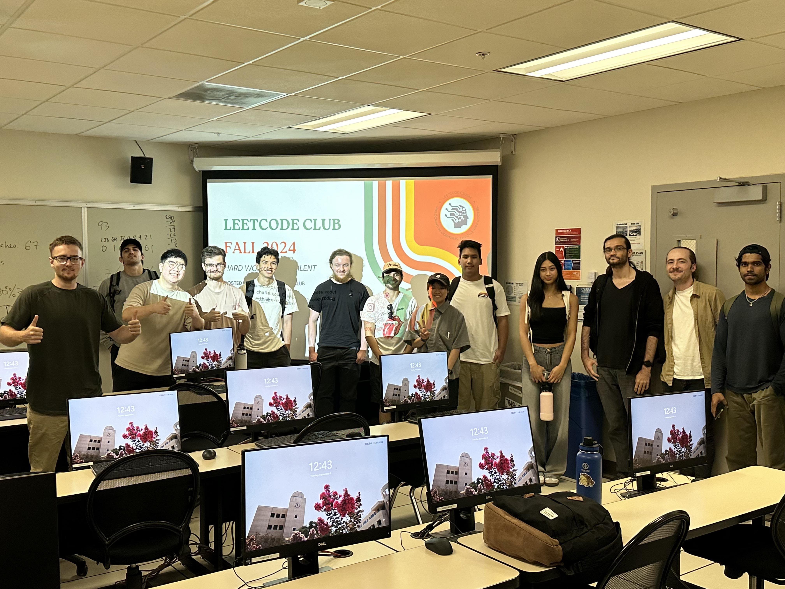

# FALL 2024 LEETCODE CLUB 

## Leadership
- **Founder / President**: Thanh Dat Vu
- **Vice President**: Aaron Hamilton
- **Treasurer**: Jacob Almon

## Meeting Information
- **Schedule**: Tuesdays, 12:00 PM - 1:00 PM
- **Location**: Academic Hall 209
- **Frequency**: 1 session per week

## Session Structure
Each session will be 1 hour long, structured as follows:
- **15 minutes**: Presentation on the data structure or algorithm of the week
- **15 minutes**: Reading and brainstorming the problems
- **30 minutes**: Solving the LeetCode problems

## Programming Language
- **Language**: Python

## LeetCode Problems
We will work through the [Top Interview 150](https://leetcode.com/studyplan/top-interview-150/) problems:
- [Top Interview 150 Study Plan](https://leetcode.com/studyplan/top-interview-150/)
- [Algomap.io](https://algomap.io/)

During each session, we aim to tackle 1-2 problems. Our goal is for each member to solve at least 30 problems on their LeetCode profile by the end of the semester and to understand strategies for effectively tackling these problems.

## Point System
- **1 point**: Attending a club session
- **2 points**: Both members receive 2 points if they bring a friend
- **3 points**: Attending a coding contest

## CLub Schedule
- [Fall 2024](https://docs.google.com/document/d/1vXjeqh9cd71D5dTcXQQb2FCFjzebaIfdrs_NxAEQ5FQ/edit?usp=sharing)

## Group Picture
